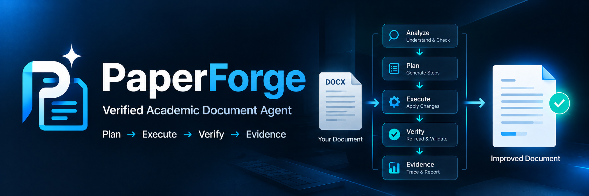
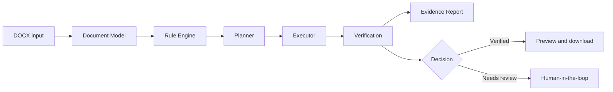

<p align="center">
  
</p>

# PaperForge

> **Verified Academic Document Agent**

PaperForge is a verified AI agent that transforms academic DOCX documents through **planning, execution, verification, and evidence reporting**. AI can assist with analysis and suggestions, but it is not treated as proof that a document was changed correctly: deterministic rules execute supported low-risk changes, the result is re-read, and every outcome remains traceable for human review.

**Explore:** [30-second demo](docs/DEMO_GUIDE.md) · [Architecture](docs/ARCHITECTURE_OVERVIEW.md) · [Limitations](docs/LIMITATIONS.md)

**Engineering focus:** Verified Agent Loop · Deterministic Execution · LLM Optional · Human-in-the-loop · Evidence & Trace

## The problem

Academic document formatting is often repetitive, error-prone, and difficult to audit. A black-box text response cannot establish that a Word document was safely changed, that its structure survived, or that an unsupported change was not silently applied.

PaperForge turns this into an inspectable document-processing workflow. It supports common formatting and constrained content-review actions while preserving clear boundaries for complex or high-risk changes.

## The verified approach



PaperForge separates responsibilities deliberately:

- **AI analyzes and proposes.** It can assist with language review, but does not receive unrestricted authority to rewrite a document.
- **Rules plan and execute.** Deterministic, target-aware rules apply supported low-risk changes.
- **Verification checks the output.** The generated DOCX is re-read and compared against expected results where reliable locators exist.
- **Evidence explains the outcome.** Provenance records connect rules, plan steps, before/after values, execution, and verification.

This makes the system more than a formatter or an API wrapper: a suggestion is not reported as successful merely because a model produced it.

## Core capabilities

| Capability | What it provides |
| --- | --- |
| Document understanding | DOCX classification, normalized document model, template extraction, and document analysis. |
| Safe execution | Low-risk formatting for titles, body text, fonts, spacing, indentation, margins, and selected captions. |
| Verified Agent Loop | Rule-driven planning, conflict checks, target-aware execution, output re-read, and verification. |
| Human-in-the-loop | Automatic handling for safe actions; suggestions and high-risk or ambiguous actions remain reviewable. |
| Observability | Agent Trace, task state, modification reports, before/after evidence, provenance, and pending actions. |
| Reliable fallback | Deterministic local mode; AI mode falls back without interrupting the main workflow when an LLM is unavailable. |
| Delivery loop | Online preview and download of the resulting DOCX. |

## Trust and control

### LLM is optional

Local mode remains deterministic and runs without an LLM (`ai_score = null`, `ai_used = false`). In AI mode, an unavailable or failed LLM falls back to local rules rather than breaking document processing. AI is used where it is useful—analysis and review—not as an unchecked document-editing authority.

### Human-in-the-loop by policy

Low-risk, supported actions can be applied automatically. High-risk facts, numbers, experimental results, conclusions, citations, methods, definitions, formulas, and ambiguous targets are surfaced for review instead of being silently overwritten.

### Observable execution

The result includes an Agent Trace plus evidence of what was planned, modified, verified, deferred, or left unresolved. Failed or unsupported verification is not represented as a successful result.


The screenshots record a real local run on 2026-06-27. The displayed score change (`81 → 87`) belongs to that sample run and is not a general performance guarantee.

## System architecture

PaperForge is a deliberately small, inspectable architecture:

```text
Next.js frontend
        ↓ upload, results, review, preview, download
FastAPI API
        ↓
Agent runtime
        ↓
Document Model → Rule Engine → Planner → Executor → Verifier → Governance
        ↓                                                    ↓
DOCX storage                                      Provenance / Evidence / Trace
```

The frontend does not modify DOCX files directly. The backend maintains the document-processing boundary and exposes classify, run, preview, and download endpoints. See [Architecture Overview](docs/ARCHITECTURE_OVERVIEW.md) for the GitHub-friendly system view and [detailed architecture](docs/ARCHITECTURE.md) for implementation-level boundaries.

## Demo

The repository includes constructed, de-identified demo inputs, a template, and outputs from a real local run:


*Real local application screenshot. The included demo uses a constructed, de-identified sample document; it is not a paper-generation or formal plagiarism-checking service.*

- `demo_inputs/messy_paper_sample.docx`
- `demo_inputs/template_sample.docx`
- `demo_outputs/formatted_result_sample.docx`
- `demo_outputs/report_sample.json`
- `demo_outputs/agent_trace_sample.json`

In about 30 seconds, upload the paper, select local mode, run the Agent, inspect the Trace and verification result, preview the output, and download the DOCX. Follow the [Demo Guide](docs/DEMO_GUIDE.md) for the exact flow and presentation notes.

## Verification results

The V2 acceptance baseline records:

- 26 core capability checks passed;
- end-to-end scenarios A–F passed;
- Safety Audit, Provenance / Verification, Score Credibility, AI failure fallback, and legacy compatibility passed;
- real DOCX regression: **10/10 PASS, 0 warnings, 0 blocking failures**;
- frontend production build passed.

These are repository acceptance results, not a claim that every DOCX will receive the same outcome. Human review is still recommended before submission.

## Known limitations

PaperForge is not a general Word automation system, a paper-writing tool, or an authority for plagiarism results. Complex Word features and unsupported targets remain subject to review. See [Limitations](docs/LIMITATIONS.md) for supported boundaries and non-goals.

## Roadmap

- Improve robustness for complex templates, references, and advanced DOCX structures.
- Expand safe, evidence-backed document checks before widening automated modifications.
- Improve content-review quality while retaining policy gates, verification, and human confirmation.

The project is currently in V2 Release Freeze; roadmap work does not imply that the listed capabilities are available today.

## Quick start

### Local development

Backend:

```powershell
cd paper-ai/backend
python -m venv .venv
.\.venv\Scripts\Activate.ps1
pip install -r requirements.txt
uvicorn main:app --reload --host 127.0.0.1 --port 8000
```

Frontend, in a second terminal:

```powershell
cd paper-ai/frontend
npm install
npm run dev
```

Open `http://127.0.0.1:3000`. The backend health endpoint is `http://127.0.0.1:8000/health`.

### Docker Compose

```powershell
Copy-Item paper-ai/backend/.env.example paper-ai/backend/.env
docker compose up --build
```

Set `NEXT_PUBLIC_API_BASE_URL` for a non-local backend and configure `CORS_ORIGINS` when the frontend is hosted elsewhere. See [Docker deployment](docs/DOCKER_DEPLOYMENT.md).

## Verification commands

```powershell
cd paper-ai/backend
python -m compileall -q main.py services
python test_p2_content_review_closure.py
python test_p2_closure.py
python test_score_consistency.py
python test_smoke_agent_flow.py

cd ../frontend
npm run build
```

`paper-ai/backend/run_real_doc_regression.py` is the full DOCX regression entry point. It uses repository test assets and writes results to an ignored regression-output directory.

## Documentation

- [Architecture Overview](docs/ARCHITECTURE_OVERVIEW.md)
- [Detailed Architecture](docs/ARCHITECTURE.md)
- [Demo Guide](docs/DEMO_GUIDE.md)
- [Limitations](docs/LIMITATIONS.md)
- [Risk Level System](docs/RISK_LEVEL_SYSTEM.md)
- [Agent Trace](docs/AGENT_TRACE.md)
- [Documentation index](docs/README.md)

## Release status

The current public release is **PaperForge V2**, tagged `v2.0-paperforge`.

## Technology

FastAPI · Python · `python-docx` · Next.js · React · TypeScript · Docker Compose

## License

MIT License
