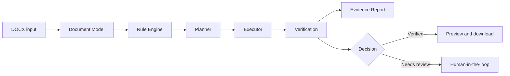

<p align="center">
  
</p>

# PaperForge

> **Verified Academic Document Agent / 可验证的学术文档 Agent**

**当前版本 / Current release:** PaperForge **v3.7.5** · **READY FOR CONTROLLED PUBLIC BETA**. Production access is available at [aetherislab.xyz](https://aetherislab.xyz); authenticated end-to-end and tenant-isolation validation remains intentionally controlled.

PaperForge 是一个可验证的 AI 学术文档 Agent，通过**规划、执行、验证和证据报告**处理学术 DOCX 文档。AI 可以辅助分析和提出建议，但不会被视为文档已正确修改的证明：确定性规则负责执行支持的低风险修改，系统会重新读取结果，并为每次处理保留可供人工复查的追踪信息。

PaperForge is a verified AI agent that transforms academic DOCX documents through **planning, execution, verification, and evidence reporting**. AI can assist with analysis and suggestions, but it is not treated as proof that a document was changed correctly: deterministic rules execute supported low-risk changes, the result is re-read, and every outcome remains traceable for human review.

**快速了解 / Explore:** [产品与文档导航 / Product documentation](docs/README.md) · [架构 / Architecture](docs/ARCHITECTURE_OVERVIEW.md) · [限制 / Limitations](docs/LIMITATIONS.md) · [仓库治理 / Repository governance](docs/REPOSITORY_GOVERNANCE.md)

**工程重点 / Engineering focus:** 可验证 Agent 闭环 / Verified Agent Loop · 确定性执行 / Deterministic Execution · LLM 可选 / LLM Optional · 人在回路 / Human-in-the-loop · 证据与追踪 / Evidence & Trace

## 要解决的问题 / The problem

学术文档排版通常重复、容易出错，也很难审计。黑盒式的文本回复无法证明 Word 文档是否被安全修改、结构是否保持完整，或者某个不支持的修改是否被静默执行。

Academic document formatting is often repetitive, error-prone, and difficult to audit. A black-box text response cannot establish that a Word document was safely changed, that its structure survived, or that an unsupported change was not silently applied.

PaperForge 将这一过程变成可检查的文档处理工作流。它支持常见格式修复和受约束的内容审校，同时为复杂或高风险修改保留清晰边界。

PaperForge turns this into an inspectable document-processing workflow. It supports common formatting and constrained content-review actions while preserving clear boundaries for complex or high-risk changes.

## 可验证的方法 / The verified approach



PaperForge 对职责进行了明确拆分：

- **AI 负责分析和提出建议。** AI 可以辅助语言审校，但不会获得不受限制的文档重写权限。
- **规则负责规划和执行。** 确定性、面向目标的规则负责应用支持的低风险修改。
- **验证负责检查输出。** 系统会重新读取生成的 DOCX，并在存在可靠定位信息时与预期结果进行比较。
- **证据负责解释结果。** 来源记录会关联规则、计划步骤、修改前后值、执行过程和验证结果。

PaperForge is therefore more than a formatter or an API wrapper: a suggestion is not reported as successful merely because a model produced it.

## 核心能力 / Core capabilities

| 能力 / Capability | 说明 / What it provides |
| --- | --- |
| 文档理解 / Document understanding | DOCX 分类、标准化文档模型、模板提取和文档分析 / DOCX classification, normalized document model, template extraction, and document analysis. |
| 安全执行 / Safe execution | 对标题、正文、字体、行距、缩进、页边距和部分题注执行低风险格式修复 / Low-risk formatting for titles, body text, fonts, spacing, indentation, margins, and selected captions. |
| 可验证 Agent 闭环 / Verified Agent Loop | 规则驱动规划、冲突检查、目标感知执行、输出重读和验证 / Rule-driven planning, conflict checks, target-aware execution, output re-read, and verification. |
| 人在回路 / Human-in-the-loop | 安全操作可自动处理；建议、高风险或有歧义的操作保留人工复查 / Automatic handling for safe actions; suggestions and high-risk or ambiguous actions remain reviewable. |
| 可观测性 / Observability | Agent Trace、任务状态、修改报告、前后证据、来源记录和待处理操作 / Agent Trace, task state, modification reports, before/after evidence, provenance, and pending actions. |
| 可靠降级 / Reliable fallback | 确定性的 local 模式；LLM 不可用时，ai 模式降级且不中断主流程 / Deterministic local mode; AI mode falls back without interrupting the main workflow when an LLM is unavailable. |
| 交付闭环 / Delivery loop | 在线预览并下载处理后的 DOCX / Online preview and download of the resulting DOCX. |

## 信任与控制 / Trust and control

### LLM 是可选项 / LLM is optional

local 模式是确定性的，无需 LLM（`ai_score = null`、`ai_used = false`）。ai 模式中，如果 LLM 不可用或调用失败，系统会回退到本地规则，不会中断文档处理。AI 用于分析和审校，而不是未经检查的文档编辑权限。

Local mode remains deterministic and runs without an LLM (`ai_score = null`, `ai_used = false`). In AI mode, an unavailable or failed LLM falls back to local rules rather than breaking document processing. AI is used where it is useful—analysis and review—not as an unchecked document-editing authority.

### 按策略保留人工复查 / Human-in-the-loop by policy

支持的低风险操作可以自动应用。事实、数字、实验结果、结论、引用、方法、定义、公式以及有歧义的目标会被提交复查，而不会被静默覆盖。

Low-risk, supported actions can be applied automatically. High-risk facts, numbers, experimental results, conclusions, citations, methods, definitions, formulas, and ambiguous targets are surfaced for review instead of being silently overwritten.

### 可观察的执行过程 / Observable execution

结果中包含 Agent Trace，以及关于已规划、已修改、已验证、已延期或仍未解决内容的证据。验证失败或不支持的验证不会被表示为成功结果。

The result includes an Agent Trace plus evidence of what was planned, modified, verified, deferred, or left unresolved. Failed or unsupported verification is not represented as a successful result.

当前 SaaS 界面会持续演进，因此公开入口不使用早期静态 UI 截图代替当前产品状态。历史演示材料仅保留在 [archive](docs/archive/README.md) 中，不能作为当前界面或性能承诺。

The SaaS interface continues to evolve, so this public entrypoint does not use early static UI screenshots as a substitute for current product state. Historical demo material is retained only in the [archive](docs/archive/README.md) and is not a claim about the current UI or performance.

## 系统架构 / System architecture

PaperForge 采用小型、可检查的架构 / PaperForge is a deliberately small, inspectable architecture:

```text
Next.js frontend
        ↓ upload, results, review, preview, download
FastAPI API
        ↓
Agent runtime
        ↓
Document Model → Rule Engine → Planner → Executor → Verifier → Governance
        ↓                                                    ↓
DOCX storage                                      Provenance / Evidence / Trace
```

前端不会直接修改 DOCX。后端维护文档处理边界，并提供分类、运行、预览和下载接口。请参阅 [架构概览 / Architecture Overview](docs/ARCHITECTURE_OVERVIEW.md) 和 [详细架构 / detailed architecture](docs/ARCHITECTURE.md)。

The frontend does not modify DOCX files directly. The backend maintains the document-processing boundary and exposes classify, run, preview, and download endpoints. See [Architecture Overview](docs/ARCHITECTURE_OVERVIEW.md) and [detailed architecture](docs/ARCHITECTURE.md).

### SaaS 任务架构 / SaaS task architecture

```text
User → Workspace → Project → Task → Agent Pipeline → Artifact
                                      ↓
                         Trace / score / verification evidence
```

任务以 Agent Trace 作为面向用户的工作流来源：分析 → 规划 → 执行 → 验证 → 完成（或失败）。Task Detail 页面展示追踪信息、分数变化、生成的 DOCX 和分析报告；Dashboard 展示工作区信息和任务统计。

Tasks use the Agent Trace as the source for the user-facing workflow: analyzing → planning → executing → verifying → completed (or failed). The Task Detail page presents the trace, score change, generated DOCX and analysis report; the Dashboard presents workspace information and task statistics.

文件处理位于小型 `StorageService` 边界之后。`LocalStorage` 仍是默认实现，继续使用现有 `uploads/` 和 `outputs/` 路径；`S3Storage` 仅作为未来云部署的适配器接口，本版本不会迁移文件。

File handling is behind a small `StorageService` boundary. `LocalStorage` remains the default and keeps the existing `uploads/` and `outputs/` paths. `S3Storage` is reserved as an adapter surface for a future cloud deployment; no files are migrated in this release.

## 当前产品工作流 / Current product workflow

登录后，在 Workspace 中创建任务、上传论文与可选模板、选择 local 或 ai 模式，然后查看任务状态、Agent Trace、验证结果、在线预览与下载产物。租户、任务、模板和产物访问均由后端授权边界保护。

After signing in, create a task in a Workspace, upload a paper and optional template, choose local or ai mode, then review task state, Agent Trace, verification results, preview, and downloadable artifacts. Tenant, task, template, and artifact access are enforced by backend authorization boundaries.

## 当前验证状态 / Current verification status

截至 2026-09-12，v3.7.5 的后端 `pytest -q` 为 **107 passed**，前端 production build 通过；生产 smoke 已覆盖认证任务、SSE、预览、下载、反馈和管理员授权。完整生产事实以 [生产运行手册 / production runbook](docs/PRODUCTION_DEPLOYMENT.md) 为准。

As of 2026-09-12, v3.7.5 recorded **107 passed** from backend `pytest -q`, with a passing frontend production build. Production smoke covered authenticated tasks, SSE, preview, download, feedback, and admin authorization. See the [production runbook](docs/PRODUCTION_DEPLOYMENT.md) for authoritative deployment facts.

这些是仓库验收结果，并不意味着所有 DOCX 都会得到相同结果。提交前仍建议人工复查。

These are repository acceptance results, not a claim that every DOCX will receive the same outcome. Human review is still recommended before submission.

## 已知限制 / Known limitations

PaperForge 不是通用 Word 自动化系统、论文写作工具，也不是正式查重结果的权威来源。复杂 Word 功能和不支持的目标仍需人工复查。支持范围和非目标请参阅 [限制说明 / Limitations](docs/LIMITATIONS.md)。

PaperForge is not a general Word automation system, a paper-writing tool, or an authority for plagiarism results. Complex Word features and unsupported targets remain subject to review. See [Limitations](docs/LIMITATIONS.md) for supported boundaries and non-goals.

## 路线图 / Roadmap

- 提升复杂模板、参考文献和高级 DOCX 结构的稳定性 / Improve robustness for complex templates, references, and advanced DOCX structures.
- 在扩大自动修改范围前，增加安全且有证据支持的文档检查 / Expand safe, evidence-backed document checks before widening automated modifications.
- 在保留策略门控、验证和人工确认的前提下，提升内容审校质量 / Improve content-review quality while retaining policy gates, verification, and human confirmation.

仓库当前处于 Controlled Public Beta；路线图不表示上述能力今天已经全部可用。生产部署事实以 [生产部署手册 / production runbook](docs/PRODUCTION_DEPLOYMENT.md) 为准，而不是聊天记录。

The repository is in Controlled Public Beta; roadmap work does not imply that the listed capabilities are available today. Production deployment facts live in [the production runbook](docs/PRODUCTION_DEPLOYMENT.md), not in chat history.

## 快速开始 / Quick start

### 本地开发 / Local development

后端 / Backend:

```powershell
cd paper-ai/backend
python -m venv .venv
.\.venv\Scripts\Activate.ps1
pip install -r requirements.txt
uvicorn main:app --reload --host 127.0.0.1 --port 8000
```

前端请在第二个终端运行 / Frontend, in a second terminal:

```powershell
cd paper-ai/frontend
npm install
npm run dev
```

打开 `http://127.0.0.1:3000`。后端健康检查地址是 `http://127.0.0.1:8000/health`。

Open `http://127.0.0.1:3000`. The backend health endpoint is `http://127.0.0.1:8000/health`.

本地开发默认使用 SQLite。如果要在本地使用 PostgreSQL，请设置 `DATABASE_URL`，并在启动 API 前从 `paper-ai/backend` 执行 `alembic upgrade head`。

Local development uses SQLite by default. To use PostgreSQL locally, set `DATABASE_URL` and run `alembic upgrade head` from `paper-ai/backend` before starting the API.

### Docker Compose

```powershell
Copy-Item .env.example .env
docker compose up --build
```

如果后端不在本机，请设置 `NEXT_PUBLIC_API_BASE_URL`；当前端部署在其他地址时，请配置 `CORS_ORIGINS`。详见 [Docker 部署 / Docker deployment](docs/DOCKER_DEPLOYMENT.md)。

Set `NEXT_PUBLIC_API_BASE_URL` for a non-local backend and configure `CORS_ORIGINS` when the frontend is hosted elsewhere. See [Docker deployment](docs/DOCKER_DEPLOYMENT.md).

## 验证命令 / Verification commands

```powershell
cd paper-ai/backend
python -m compileall -q main.py services
python test_p2_content_review_closure.py
python test_p2_closure.py
python test_score_consistency.py
python test_smoke_agent_flow.py

cd ../frontend
npm run build
```

`paper-ai/backend/run_real_doc_regression.py` 是完整 DOCX 回归入口。它使用仓库测试资源，并将结果写入被忽略的回归输出目录。

`paper-ai/backend/run_real_doc_regression.py` is the full DOCX regression entry point. It uses repository test assets and writes results to an ignored regression-output directory.

## 文档 / Documentation

- [架构概览 / Architecture Overview](docs/ARCHITECTURE_OVERVIEW.md)
- [详细架构 / Detailed Architecture](docs/ARCHITECTURE.md)
- [安全与公开证据 / Security and public evidence](docs/knowledge/CONTENT_EVIDENCE.md)
- [限制说明 / Limitations](docs/LIMITATIONS.md)
- [风险等级系统 / Risk Level System](docs/RISK_LEVEL_SYSTEM.md)
- [Agent Trace](docs/AGENT_TRACE.md)
- [文档索引 / Documentation index](docs/README.md)

## 发布状态 / Release status

当前公开版本为 **PaperForge v3.7.5**，状态为 **READY FOR CONTROLLED PUBLIC BETA**。

The current public release is **PaperForge v3.7.5**, **READY FOR CONTROLLED PUBLIC BETA**.

## 技术栈 / Technology

FastAPI · Python · `python-docx` · Next.js · React · TypeScript · Docker Compose

## 许可证 / License

MIT License
