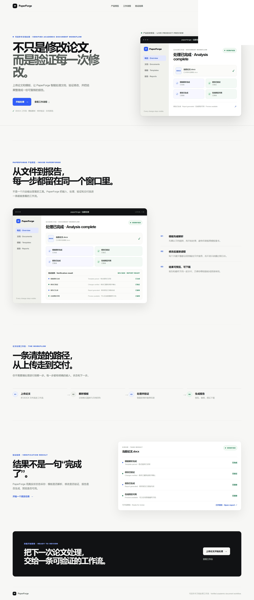
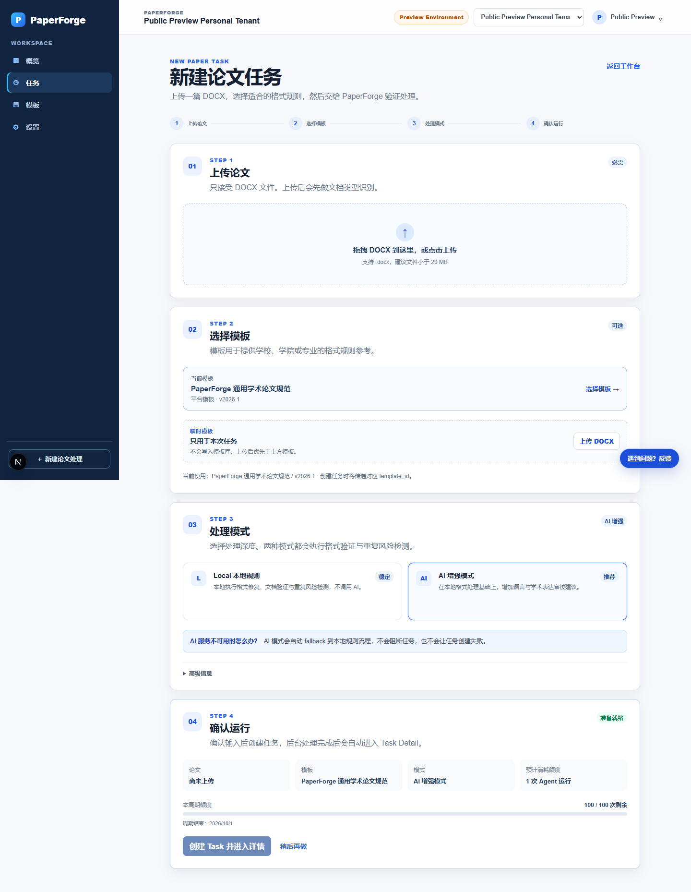
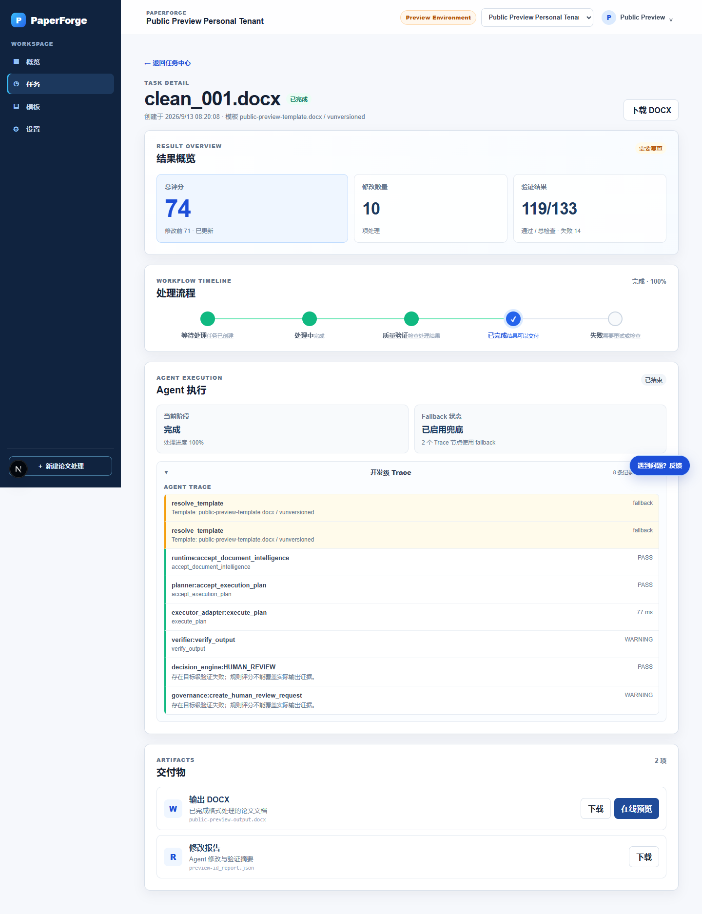
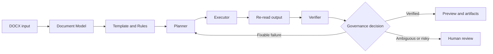
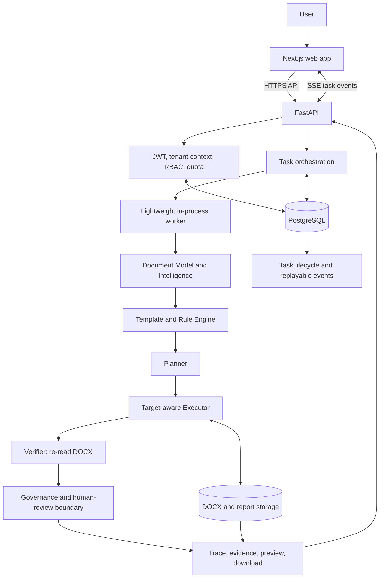

<p align="center">
  
</p>

# PaperForge

> **Verified Academic Document Agent / 可验证的学术文档 Agent**

PaperForge 将学术 DOCX 的格式处理变成一条可检查的工作流：**理解文档、解析模板、制定计划、执行低风险修改、重新读取验证，并交付证据与产物**。AI 可以辅助语言审校和建议，但模型输出本身不会被当作修改成功的证明。

PaperForge turns academic DOCX processing into an inspectable workflow: **understand the document, resolve template rules, plan changes, execute supported low-risk actions, re-read the output, and deliver evidence with the artifact**. AI may assist with language review and suggestions, but model output alone is never treated as proof of a successful edit.

**Live product / 在线产品:** [aetherislab.xyz](https://aetherislab.xyz)<br>
**Release / 当前版本:** `v3.7.5`<br>
**Stage / 当前阶段:** Controlled Public Beta Live<br>
**Docs / 文档:** [Documentation index](docs/README.md) · [Architecture](docs/ARCHITECTURE_OVERVIEW.md) · [Limitations](docs/LIMITATIONS.md) · [Repository governance](docs/REPOSITORY_GOVERNANCE.md)

## Highlights / 项目亮点

- **Verified Agent Loop / 可验证 Agent 闭环** — Document Model → Rules → Planner → Executor → Verifier → Governance；输出 DOCX 会被重新读取，而不是只相信执行过程。
- **Deterministic execution / 确定性执行** — 支持的低风险格式修改由目标感知规则执行；冲突、不支持或高风险操作进入复查边界。
- **LLM-optional workflow / LLM 可选** — local 模式不调用 LLM；ai 模式支持 DeepSeek 或 OpenAI 兼容接口，并在调用失败时回退，不中断主流程。
- **Evidence-first results / 证据优先结果** — 结果可包含 Agent Trace、计划步骤、前后值、验证摘要、修改报告和人工复查项。
- **Multi-tenant SaaS boundary / 多租户 SaaS 边界** — JWT、Workspace membership、固定 RBAC、tenant-scoped task/template/artifact 查询和额度控制由后端统一执行。
- **Durable task history / 持久化任务历史** — PostgreSQL 保存任务生命周期和可重放事件；前端通过 SSE 展示进度。当前执行 worker 仍是单进程实现，并非分布式队列。
- **DOCX delivery loop / DOCX 交付闭环** — 支持论文与可选模板上传、在线预览、修改报告以及处理后 DOCX 下载。

## What users can do / 用户实际能做什么

1. **Create a task / 创建任务** — 登录 Workspace，上传 `.docx` 论文，并选择已有模板或临时上传模板。
2. **Choose processing mode / 选择处理模式** — 使用确定性的 local 模式，或启用带可靠回退的 ai 模式。
3. **Review document understanding / 检查文档理解** — 查看文档分类、模板身份、检测问题和计划处理范围；非标准论文需要明确确认后继续。
4. **Follow execution / 跟踪执行** — 在任务详情中查看 analyzing → planning → executing → verifying 的状态与 Agent Trace。
5. **Inspect evidence / 核对证据** — 查看实际修改、验证结果、未支持项、冲突和需要人工判断的内容。
6. **Preview and export / 预览与导出** — 在线预览处理结果，下载修改后的 DOCX 和分析报告。

local 模式保证 `ai_score = null`、`ai_used = false`。ai 模式中的 LLM 失败会触发本地回退；不会因为 AI 不可用而中断格式处理，也不会让 AI 参考评分拉低最终格式评分。

Local mode guarantees `ai_score = null` and `ai_used = false`. In AI mode, an LLM failure activates the local fallback: formatting continues, and the optional AI reference score does not reduce the final formatting score.

## Product tour / 产品展示

下面是经过脱敏审查的真实生产 Landing 页面。它只证明产品已部署，不代表使用量、性能、准确率或成功率。

The following sanitized image is from the live production landing page. It is deployment evidence only—not a usage, performance, accuracy, or success-rate claim.

<p align="center">
  
</p>

以下工作流截图来自当前 `main` 的本地运行版本，使用合成 Workspace 与测试 DOCX，用于展示 New Task 和可追踪的 Task Detail，不作为生产指标。

The workflow images below come from the current `main` local runtime with a synthetic Workspace and test DOCX. They demonstrate New Task and traceable Task Detail behavior, not production metrics.

<p align="center">
  
</p>

<p align="center">
  
</p>

## How verification works / 验证如何工作



- **Understand / 理解：** 分类 DOCX，建立标准化文档模型，并识别标题、正文、摘要、关键词、参考文献、表格和图片等结构。
- **Plan / 规划：** 将模板规则、检测问题、风险和可靠定位信息转为显式执行步骤。
- **Execute / 执行：** 只应用当前支持的低风险操作，并记录目标、字段、预期值与修改前后信息。
- **Verify / 验证：** 重新读取输出 DOCX，将实际结果与计划目标比较，同时检查结构完整性。
- **Govern / 治理：** 验证失败可触发有限重规划；冲突、高风险内容和不支持项进入人工复查，不伪装为成功。

## Result package / 结果交付

仓库目前没有一个适合公开宣传、同时具备稳定输入、脱敏产物和可复现基线的单一“示例分数”。因此 README 不展示虚构或脱离上下文的分数提升，而展示真实结果契约。

The repository does not currently contain one public, sanitized, reproducible benchmark artifact suitable for a headline “example score.” This README therefore shows the real result contract instead of inventing or decontextualizing a score improvement.

| Output / 输出 | What it means / 含义 |
| --- | --- |
| Processed DOCX / 处理后 DOCX | 应用已支持且获准执行的修改后生成的可下载 Word 文件。 |
| Verification summary / 验证摘要 | 按目标统计 verified、failed、unsupported，并保留结构完整性检查。 |
| Modification report / 修改报告 | 汇总实际格式修改、内容建议、修改计数、评分解释和人工复查项。 |
| Agent Trace / 执行追踪 | 记录分析、规划、执行、验证、回退和最终决策过程。 |
| Provenance evidence / 来源证据 | 关联规则、计划步骤、目标、修改前后值以及重新读取后的验证证据。 |
| Preview and artifacts / 预览与产物 | 提供 HTML 在线预览、DOCX 下载和报告 Artifact。 |

评分是诊断信息，不是论文质量、录用概率或通用 DOCX 正确率承诺。所有提交前文档仍建议人工复查。

Scores are diagnostic signals, not promises about paper quality, acceptance probability, or universal DOCX correctness. Human review is still recommended before submission.

## Architecture / 系统架构



前端不直接修改 DOCX。FastAPI 负责认证、租户边界、上传校验、任务与 Artifact API；进程内 worker 调用 Agent pipeline；SQLAlchemy/Alembic 管理持久化模型与迁移；生产使用 PostgreSQL，本地开发默认可使用 SQLite。文件通过 `StorageService` 边界处理，当前实现是本地文件系统，不宣称已使用对象存储。

The frontend never edits DOCX files directly. FastAPI owns authentication, tenant boundaries, upload validation, task and artifact APIs; an in-process worker invokes the Agent pipeline; SQLAlchemy and Alembic manage persistence and migrations. Production uses PostgreSQL, while local development can default to SQLite. Files sit behind a `StorageService` boundary whose current implementation is local filesystem storage—not object storage.

See [Architecture Overview](docs/ARCHITECTURE_OVERVIEW.md) and [Detailed Architecture](docs/ARCHITECTURE.md) for component boundaries and execution details.

## Technology stack / 技术栈

| Layer / 层 | Technology / 技术 | Role / 用途 |
| --- | --- | --- |
| Web application / Web 应用 | Next.js `15.5.24`, React `19.0.0`, TypeScript `5.7.2`, CSS Modules | SaaS routes, task creation, Dashboard, Task Detail, trace, preview and artifact UX. |
| API runtime / API 运行时 | Python, FastAPI `0.115.6`, Uvicorn `0.34.0` | REST endpoints, validation, authorization, SSE and document workflow orchestration. |
| DOCX processing / DOCX 处理 | `python-docx 1.1.2` | Parse, classify, inspect, format, re-read and render DOCX content for preview. |
| Agent runtime / Agent 运行时 | Document Model, Rule Engine, Planner, Executor, Verifier, Governance | Explicit plan/execute/verify loop with bounded re-planning and human-review decisions. |
| Optional AI review / 可选 AI 审校 | OpenAI Python SDK `1.59.7`; DeepSeek or OpenAI-compatible endpoint | Language analysis and suggestions with a deterministic local fallback. |
| Persistence / 持久化 | SQLAlchemy `2.0.36`, Alembic `1.14.0`, PostgreSQL 16, Psycopg `3.2.3`; SQLite for local development | Users, tenants, memberships, templates, tasks, task events, artifacts, quota and feedback metadata. |
| Authentication and isolation / 认证与隔离 | JWT via PyJWT `2.10.1`, token versioning, tenant context, fixed RBAC | Authenticated sessions, session revocation and tenant-scoped resource access. |
| Task updates / 任务更新 | Database-backed task lifecycle, append-only task events, SSE with `Last-Event-ID` | Progress display and replayable task history; not a distributed worker queue. |
| Deployment / 部署 | Docker, Docker Compose, Nginx edge configuration, GitHub Actions, Aliyun ACR/ECS | Immutable frontend/backend image delivery and production runtime configuration. |
| Validation / 验证 | Pytest suite, Python compile checks, Next.js production build, Alembic migration checks, DOCX regression and production smoke scripts | Regression, build, migration and end-to-end release checks. |

## Project status / 项目状态

| Item / 项目 | Current state / 当前状态 |
| --- | --- |
| Release | `v3.7.5` |
| Product stage / 产品阶段 | Controlled Public Beta Live |
| Production / 生产环境 | Frontend and API deployed on Aliyun ECS with immutable images; canonical release path uses ACR. |
| Recorded validation / 已记录验证 | Backend `pytest -q`: **107 passed**; frontend production build: **PASS**. |
| Verified release paths / 已验收链路 | Authentication, tenant isolation, local and AI processing, SSE, preview, DOCX download, feedback and admin authorization. |
| Current execution boundary / 当前执行边界 | Single-process worker; restart recovery marks orphaned running tasks as interrupted rather than pretending to resume. |
| Known product boundary / 已知产品边界 | Complex templates, advanced Word structures, references and deep content revision still require further work and human review. |

Authoritative release and runtime facts live in [PROJECT_STATUS.md](PROJECT_STATUS.md) and the [production runbook](docs/PRODUCTION_DEPLOYMENT.md). Roadmap work is not presented as an already shipped capability.

权威发布与运行事实以 [PROJECT_STATUS.md](PROJECT_STATUS.md) 和[生产运行手册](docs/PRODUCTION_DEPLOYMENT.md)为准；路线图不会被描述成已经交付的能力。

## Known limitations / 已知限制

PaperForge 不是论文代写工具、通用 Word 自动化系统，也不是正式查重结果的权威来源。当前“重复风险检测 / 相似度预检”只用于风险提示；复杂页眉页脚、目录、脚注、公式编号、图片题注和不可靠定位的内容仍可能需要人工处理。

PaperForge is not a paper-writing service, a general Word automation system, or an authority for formal plagiarism results. Its duplicate-risk and similarity pre-checks are advisory. Complex headers and footers, tables of contents, footnotes, equation numbering, figure captions, and content without reliable targets may still require manual work.

See [Limitations](docs/LIMITATIONS.md) and [Risk Level System](docs/RISK_LEVEL_SYSTEM.md) for the supported boundary.

## Quick start / 快速开始

### Local development / 本地开发

Backend / 后端:

```powershell
cd paper-ai/backend
python -m venv .venv
.\.venv\Scripts\Activate.ps1
pip install -r requirements.txt
uvicorn main:app --reload --host 127.0.0.1 --port 8000
```

Frontend / 前端（第二个终端）:

```powershell
cd paper-ai/frontend
npm install
npm run dev
```

Open `http://127.0.0.1:3000`; backend health is available at `http://127.0.0.1:8000/health`. Local development defaults to SQLite. To use PostgreSQL, set `DATABASE_URL` and run `alembic upgrade head` from `paper-ai/backend` before starting the API.

打开 `http://127.0.0.1:3000`；后端健康检查为 `http://127.0.0.1:8000/health`。本地开发默认使用 SQLite；如需 PostgreSQL，请设置 `DATABASE_URL`，并在启动 API 前于 `paper-ai/backend` 执行 `alembic upgrade head`。

### Docker Compose

```powershell
Copy-Item .env.example .env
docker compose up --build
```

For non-local deployments, `NEXT_PUBLIC_API_BASE_URL` is a frontend build-time value and `CORS_ORIGINS` is a backend runtime allowlist. See [Docker deployment](docs/DOCKER_DEPLOYMENT.md). Production releases must use the canonical ACR pipeline; the historical `ops/acr-build-v3.6` path is retired.

非本地部署中，`NEXT_PUBLIC_API_BASE_URL` 是前端构建时变量，`CORS_ORIGINS` 是后端运行时白名单。详见 [Docker deployment](docs/DOCKER_DEPLOYMENT.md)。生产发布必须使用 canonical ACR pipeline；历史 `ops/acr-build-v3.6` 路径已经废弃。

## Verification commands / 验证命令

```powershell
cd paper-ai/backend
python -m compileall -q main.py services
python test_p2_content_review_closure.py
python test_p2_closure.py
python test_score_consistency.py
python test_smoke_agent_flow.py

cd ../frontend
npm run build
```

The full DOCX regression entry point is `paper-ai/backend/run_real_doc_regression.py`. It uses repository test assets and writes outputs to ignored regression directories.

完整 DOCX 回归入口是 `paper-ai/backend/run_real_doc_regression.py`；它使用仓库测试资源，并将输出写入 Git 忽略的回归目录。

## Documentation / 文档

- [Documentation index / 文档索引](docs/README.md)
- [Architecture overview / 架构概览](docs/ARCHITECTURE_OVERVIEW.md)
- [Detailed architecture / 详细架构](docs/ARCHITECTURE.md)
- [Agent Trace](docs/AGENT_TRACE.md)
- [Security and public evidence / 安全与公开证据](docs/knowledge/CONTENT_EVIDENCE.md)
- [Limitations / 限制说明](docs/LIMITATIONS.md)
- [Production deployment / 生产部署](docs/PRODUCTION_DEPLOYMENT.md)

## License / 许可证

MIT License
