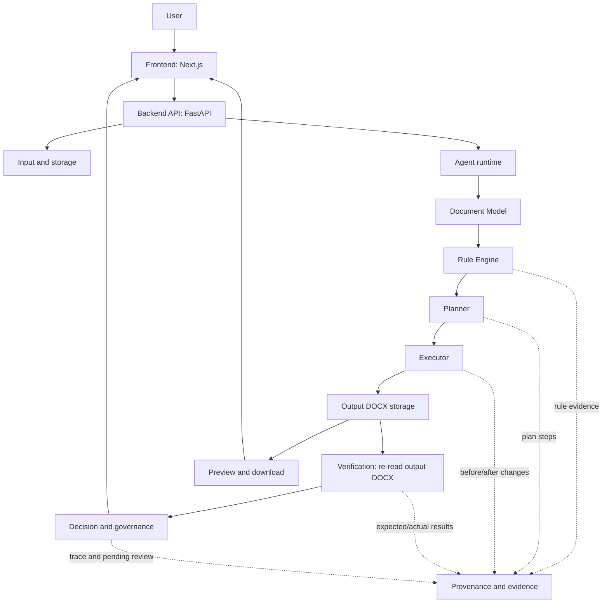
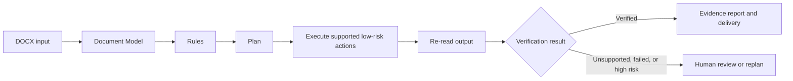

# PaperForge Architecture Overview

PaperForge is designed as a verified document-processing workflow rather than a free-form document-editing loop. It keeps planning, execution, verification, and human review explicit so a result can be inspected after the fact.

## System view

## Execution loop

## Module responsibilities

| Module | Responsibility | Boundary |
| --- | --- | --- |
| Frontend | Upload, mode selection, result presentation, Trace, evidence, review, preview, and download. | Does not edit or parse DOCX files directly. |
| Backend API | Receives files and exposes classify, run, preview, and download endpoints. | Keeps HTTP and file-handling concerns separate from document rules. |
| Document Model | Converts supported DOCX structure into a normalized model and locators. | Does not infer unrestricted semantic edits. |
| Rule Engine | Defines supported rules, evidence, risk level, and eligible actions. | Unsupported or high-risk targets are not silently promoted to auto-fixes. |
| Planner | Produces stable plan steps and detects duplicate or conflicting target-field work. | Does not claim execution has occurred. |
| Executor | Applies supported target-aware formatting and controlled actions. | Writes provenance for actual changes; unsupported work stays explicit. |
| Verification | Re-reads output DOCX and compares expected and actual values when a reliable locator is available. | A failed or missing verification is not reported as success. |
| Governance | Selects COMPLETE, REPLAN, HUMAN_REVIEW, or FAIL and records pending review. | Does not bypass risk policy. |
| Storage | Retains uploaded inputs, output DOCX files, preview sources, and task-state artifacts. | Runtime artifacts are managed separately from committed demo samples. |

## LLM and fallback boundary

AI assistance is optional. In `local` mode, PaperForge executes deterministic local processing and reports `ai_score = null` and `ai_used = false`. In `ai` mode, an unavailable LLM falls back to local rules without interrupting the primary document-processing path.

The LLM can assist analysis and language-review candidates. It is not itself the proof that a change was applied correctly; the executor, verifier, provenance, and governance layers provide that evidence.

## Human-in-the-loop boundary

PaperForge automatically handles only supported low-risk actions. High-risk facts, experimental results, conclusions, citations, methods, definitions, formulas, and ambiguous targets remain visible for human review. This is an intentional reliability boundary, not an incomplete success state.

For implementation-level file paths, runtime compatibility fields, and fallback detail, see [ARCHITECTURE.md](ARCHITECTURE.md).
