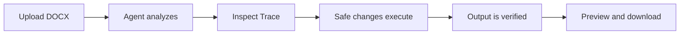

# PaperForge Demo Guide

This guide demonstrates the verified workflow in about 30 seconds using included, constructed and de-identified DOCX samples. It does not claim formal plagiarism checking, paper generation, or deep academic rewriting.

## Demo materials

- Paper: `demo_inputs/messy_paper_sample.docx`
- Optional template: `demo_inputs/template_sample.docx`
- Example local output: `demo_outputs/formatted_result_sample.docx`
- Example evidence: `demo_outputs/report_sample.json` and `demo_outputs/agent_trace_sample.json`

## 30-second walkthrough

1. Start the backend and frontend with the [Quick start](../README.md#quick-start) instructions.
2. Open `http://127.0.0.1:3000` and upload `messy_paper_sample.docx`.
3. Optionally upload `template_sample.docx`; otherwise the Agent uses general paper rules.
4. Select **local** mode for a deterministic baseline, then run the Agent.
5. Inspect the result dashboard and expand **Agent Trace** to show processing steps, fallback status, and task-state summary.
6. Review verification and any Human Review items; then open the online preview and download the resulting DOCX.

## What to point out

- The workflow separates analysis, planning, execution, and verification.
- Local mode operates without an LLM. AI mode uses a fallback if the LLM is unavailable.
- Trace and evidence distinguish actual changes from suggestions or review-required items.
- The output is re-read before it is presented as verified where reliable targets exist.

## Real application evidence

The repository includes real local application screenshots from 2026-06-27. They document a real run; they are not mockups or generated images.

| Stage | Screenshot |
| --- | --- |
| Upload ready | [03_upload_waiting_real.png](assets/screenshots/real-web-2026-06-27/03_upload_waiting_real.png) |
| Agent running | [04_running_agent_real.png](assets/screenshots/real-web-2026-06-27/04_running_agent_real.png) |
| Result dashboard | [06_result_dashboard_real.png](assets/screenshots/real-web-2026-06-27/06_result_dashboard_real.png) |
| Trace and task state | [08_trace_expanded_real.png](assets/screenshots/real-web-2026-06-27/08_trace_expanded_real.png) |
| Preview and download | [10_preview_download_real.png](assets/screenshots/real-web-2026-06-27/10_preview_download_real.png) |

The screenshots display a score change of `81 → 87` for that particular sample run. Do not present it as a universal quality metric or as evidence of formal plagiarism checking.

## Presentation boundary

Prefer the phrase **"verified document-processing workflow"** over claims of autonomous academic writing. If a document contains unsupported Word objects, ambiguous targets, or high-risk content, describe the resulting Human Review item as the intended safety behavior.

For a longer 60–90 second script and interview discussion points, see [DEMO_SCRIPT.md](DEMO_SCRIPT.md) and [INTERVIEW_DEMO_PACKAGE.md](INTERVIEW_DEMO_PACKAGE.md).
